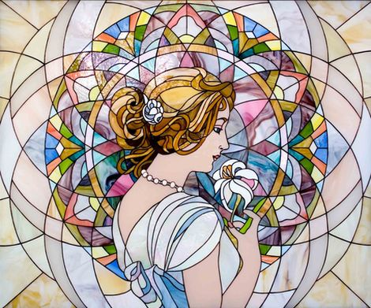
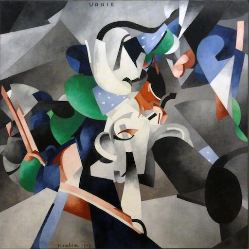
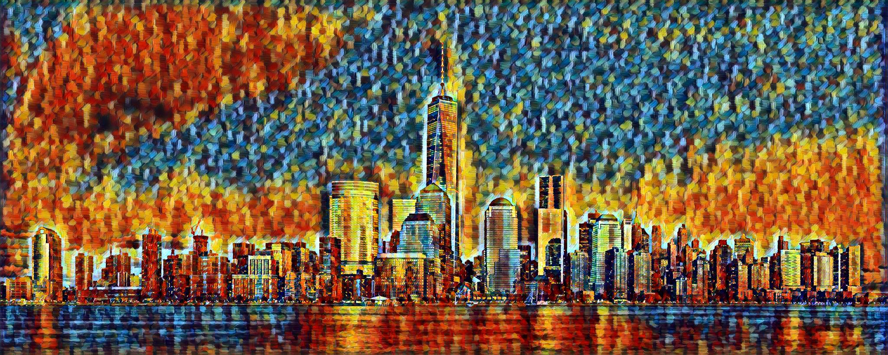
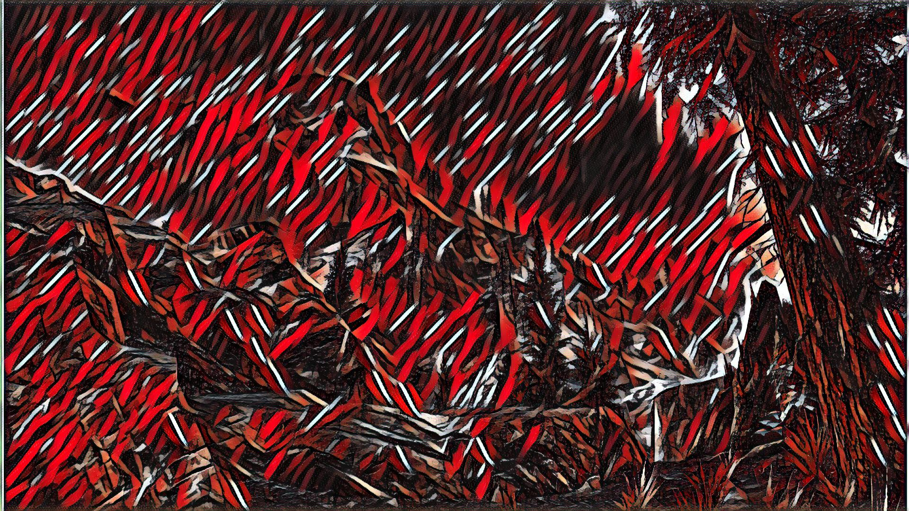

# fast-neural-style :city_sunrise: 
This repository contains a pytorch implementation of an algorithm for artistic style transfer. The algorithm can be used to mix the content of an image with the style of another image. For example, here is a photograph of a door arch rendered in the style of a stained glass painting.

The model uses the method described in [Perceptual Losses for Real-Time Style Transfer and Super-Resolution](https://arxiv.org/abs/1603.08155) along with [Instance Normalization](https://arxiv.org/pdf/1607.08022.pdf). The saved-models for examples shown in the README can be downloaded from [here](https://www.dropbox.com/s/lrvwfehqdcxoza8/saved_models.zip?dl=0).

|||||||||
|:---:|:------:|:---:|:---:|:---:|:---:|:---:|:---:|:---:|
|       |        |        |             |             |             |             |             | 
|    |     |     |          |          |          |          |          | 
|      |       |       |            |            |            |            |            | 
|           |            |            |                 |                 |                 |                 |                 | 
|        |         |         |              |              |              |              |              | 
|  |   |   |        |        |        |        |        | 
|| | |      |      |      |      |      | 

<!-- <p align="center">
    
    
    
</p> -->
## To do

1. Make it run more efficently
2. Make it take up less space and memory.
3. Add tiled-gradient-accent or some equivilant. (for processing absurdly large images)
4. 
## Requirements
The program is written in Python, and uses [pytorch](http://pytorch.org/), [scipy](https://www.scipy.org). A GPU is not necessary, but can provide a significant speed up especially for training a new model. Regular sized images can be styled on a laptop or desktop using saved models.

* [pytorch](http://pytorch.org/)
* [scipy](https://www.scipy.org)
* [TQDM for making progress bars](https://pypi.org/project/tqdm/)
* glob
* Python 3
* [FFMPEG](https://www.ffmpeg.org/)

## Usage
### Stylize image
```
python neural_style.py eval --content-image </path/to/content/image> --model </path/to/saved/model> --output-image </path/to/output/image> --cuda 1
```
* `--content-image`: path to content image you want to stylize.
* `--model`: saved model to be used for stylizing the image (eg: `mosaic.pth`)
* `--output-image`: path for saving the output image.
* `--content-scale`: factor for scaling down the content image if memory is an issue (eg: value of 2 will halve the height and width of content-image)
* `--cuda`: set it to 1 for running on GPU, 0 for CPU.

### Stylize video
```
python neural_style.py video --mode 1 --fps 25 --content-video </path/to/content/video.mp4> --model </path/to/saved/model> --output-video </path/to/output/video> --cuda 1 --tmp tmp
```
* `--mode`: 0 use an image sequence. 1 use a video file.
* `--fps`: Frames per second. This should be the same as the input video. (eg: `30`)
* `--content-video`: path to content video you want to stylize.
* `--model`: saved model to be used for stylizing the video (eg: `mosaic.pth`)
* `--output-video`: path for saving the output video.
* `--tmp`: create tmp directory? if so, where?
* `--content-scale`: factor for scaling down the content video if memory is an issue (eg: value of 2 will halve the height and width of content-image)
* `--max-size`: factor for scaling down the content video if memory is an issue (eg: value of 360 will make frame about 360p)
* `--cuda`: set it to 1 for running on GPU, 0 for CPU.


### Train model
```bash
python neural_style.py train --dataset </path/to/train-dataset> --style-image </path/to/style/image> --save-model-dir </path/to/save-model/folder> --epochs 2 --cuda 1
```

There are several command line arguments, the important ones are listed below
* `--dataset`: path to training dataset, the path should point to a folder containing another folder with all the training images. I used COCO 2014 Training images dataset [80K/13GB] [(download)](http://mscoco.org/dataset/#download).
* `--style-image`: path to style-image.
* `--save-model-dir`: path to folder where trained model will be saved.
* `--cuda`: set it to 1 for running on GPU, 0 for CPU.

Refer to ``neural_style.py -h`` for other command line arguments. For training new models you might have to tune the values of `--content-weight` and `--style-weight`. The mosaic style model shown above was trained with `--content-weight 1e5` and `--style-weight 1e10`. The remaining 3 models were also trained with similar order of weight parameters with slight variation in the `--style-weight` (`5e10` or `1e11`).

## Models

Models for the examples shown below can be downloaded from [here](https://mega.nz/#F!udAxmTQT!K8ojKjqFXh4BlZNaiec8-g). 


